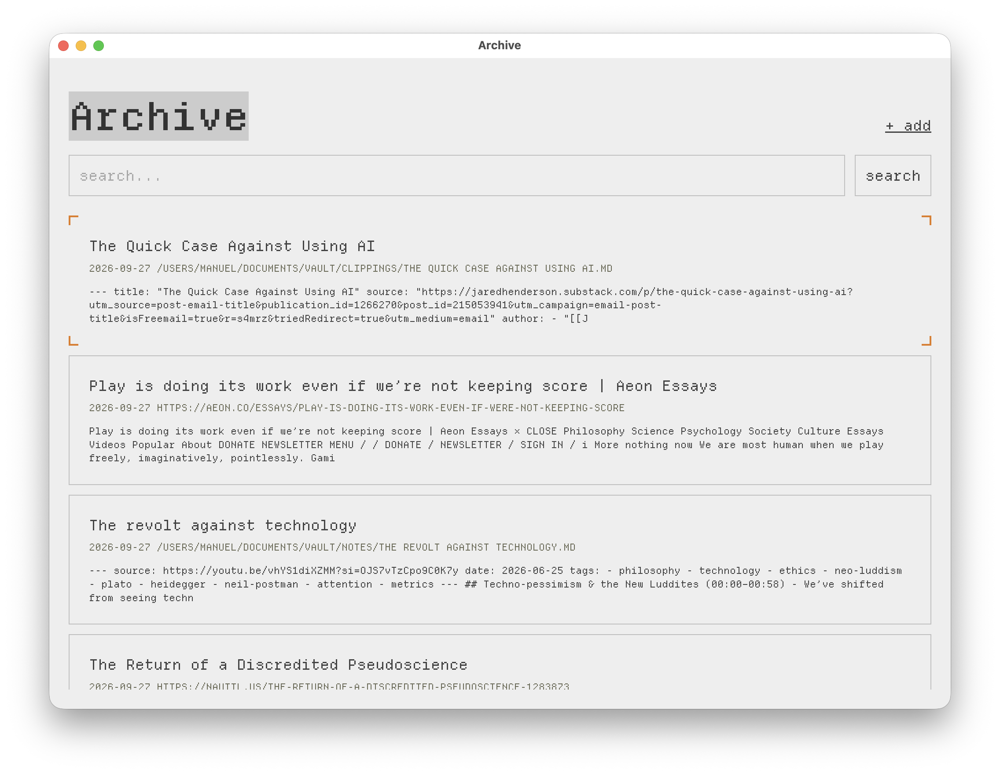
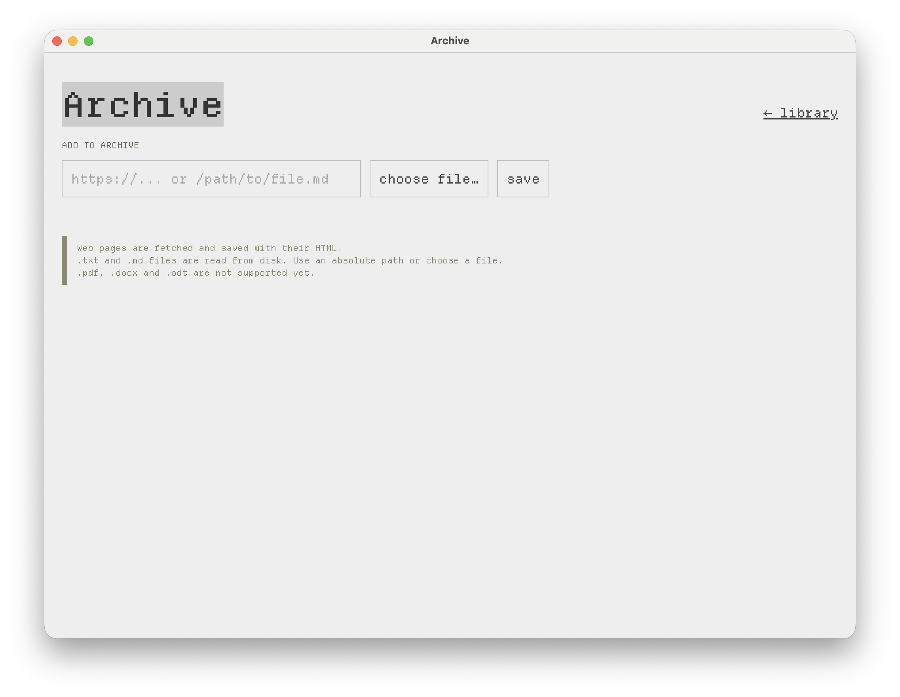
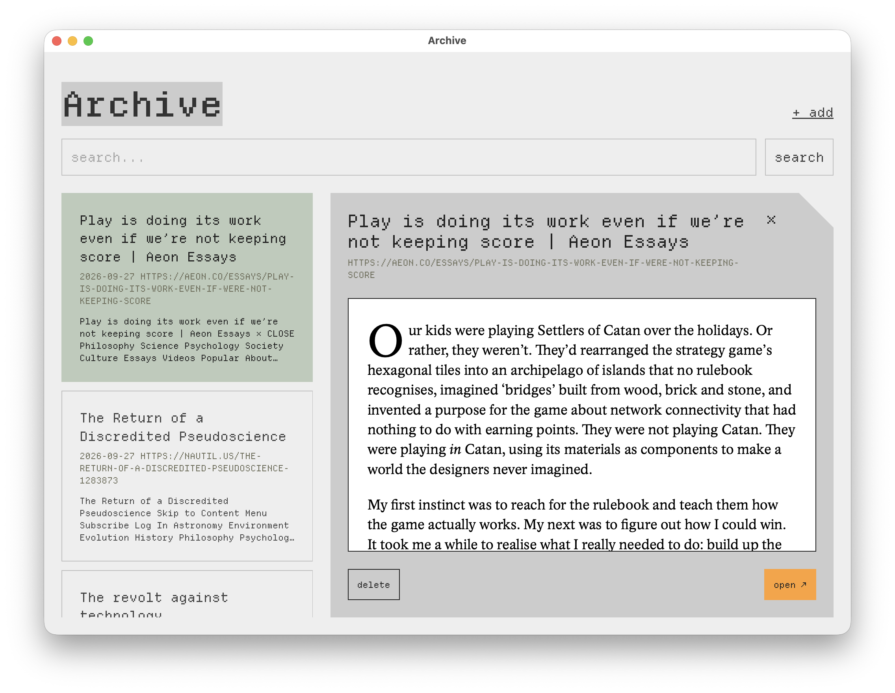
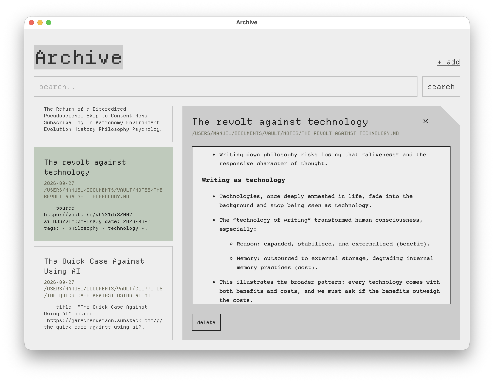

# Archive

Save web pages and documents to a local SQLite database and search them with full-text search (FTS5). Use it from the command line, or through a small desktop app. Everything stays on your machine.



```
 archive-desktop (Deno + native webview)
        │  spawns + HTTP on localhost:8080
        ▼
 archive serve (Go) ── embedded ui/ ── SQLite + FTS5
```

See [docs/architecture.md](docs/architecture.md) for the full diagram, the HTTP API and the security model.

## Requirements

- [Go](https://go.dev) 1.27+ for the CLI and HTTP server
- [Deno](https://deno.com) 2.x to build the UI and run the desktop app

Go dependencies (fetched automatically by `go build`):

- [`modernc.org/sqlite`](https://pkg.go.dev/modernc.org/sqlite): pure-Go SQLite with FTS5, so no cgo or C toolchain is needed
- [`golang.org/x/net/html`](https://pkg.go.dev/golang.org/x/net/html): HTML parsing to extract page text

Deno dependencies (declared in `desktop/deno.json`):

- [`@webview/webview`](https://jsr.io/@webview/webview): native window via the OS webview. It downloads its native library once, on first run.

## Platforms

Archive supports **macOS** and **Linux**. It may run on Windows, but some desktop features don't work there and it isn't tested.

| Feature                    | macOS | Linux               | Windows     |
| -------------------------- | ----- | ------------------- | ----------- |
| CLI and `archive serve`    | ✅    | ✅                  | ✅          |
| Desktop app                | ✅    | ✅                  | ⚠️ untested |
| "open ↗" in system browser | ✅    | ✅ (`xdg-open`)     | ⚠️ untested |
| "choose file…" picker      | ✅    | ✅ (needs `zenity`) | ❌          |
| Copy/paste shortcuts       | ✅    | ✅                  | ⚠️ untested |

On Windows, `go generate` also needs `sh` on the `PATH` (for example from Git for Windows).

## Build

```sh
./build.sh      # → dist/archive, dist/archive-desktop
```

The script builds the Svelte UI into `ui/dist` (`go generate`), embeds it in the Go binary (`go build`), then compiles the desktop app (`deno task compile`). `archive-desktop` looks for `archive` in its own directory, so keep the two binaries together.

To build only the CLI / server:

```sh
go generate && go build -o dist/archive
```

## Usage

### CLI

```sh
archive add <url | path/to/file>   # save a web page or file
archive list                       # list saved items
archive search 'terms'             # full-text search
archive del <id>                   # delete an item
archive serve                      # serve the UI + JSON API on localhost:8080
```

### Supported sources

| Source                    | Status              |
| ------------------------- | ------------------- |
| `http://`, `https://` URLs | ✅ Supported        |
| `.txt`                    | ✅ Supported        |
| `.md`                     | ✅ Supported        |
| `.pdf`                    | 🚧 Not implemented  |
| `.docx`                   | ✅ Supported |
| `.odt`            | ✅ Supported |

### Desktop

```sh
dist/archive-desktop
```

Or open <http://localhost:8080> in a browser while `archive serve` is running.

| Add a page or file                     | Read a saved page                              | Read a markdown note                                |
| -------------------------------------- | ---------------------------------------------- | --------------------------------------------------- |
|  |  |  |

### Data

The database is at `<user config dir>/archive/archive.db` (`~/Library/Application Support/archive/` on macOS, `~/.config/archive/` on Linux). The CLI and the desktop app share it. Override with `ARCHIVE_DB=/path/to/file.db`.

## Development

```sh
go test ./...                  # Go tests
cd desktop && deno task dev    # rebuild bin/archive and launch the desktop app
cd ui && deno task dev         # UI with hot reload on http://localhost:5173
```

The UI in `ui/` is embedded into the Go binary, so any edit there needs a Go rebuild (`deno task dev` in `desktop/` does this for you). For hot reload, run `bin/archive serve` and `deno task dev` in `ui/`, which proxies API calls to port 8080.

## Project layout

```
.
├── main.go, cli.go, db.go, item.go, server.go   Go CLI + HTTP server
├── build.sh                                     builds everything into dist/
├── ui/                                          Svelte frontend, embedded into the Go binary
├── desktop/                                     Deno desktop shell
└── docs/                                        documentation
```

## What's next

### Content

- [x] Text extraction for DOCX and ODT files
- [ ] Text extraction for PDF
- [x] Save a copy of the page's HTML alongside the extracted text (served at `/items/{id}/html`)
- [x] Save the page's images and stylesheets, so the saved copy renders fully offline
- [x] Skip duplicates when the same source is added twice
- [x] Store a title for each item (page `<title>` or file name)
- [ ] Watch a folder (e.g. an Obsidian vault) and keep its files indexed: `archive watch <dir>`

### Capture

- [ ] One-click save from the browser, via a bookmarklet or small extension that posts to `localhost:8080`

### Search

- [ ] Semantic search, alongside the existing full-text search

### Desktop app

- [x] Better UI, likely rebuilt with Svelte and compiled into `ui/` so the Go embed keeps working
- [x] Native file picker for adding files
- [x] Viewer for saved pages (a sandboxed iframe on `/items/{id}/html`)
- [x] Markdown renderer
- [ ] Package as a macOS `.app` bundle
